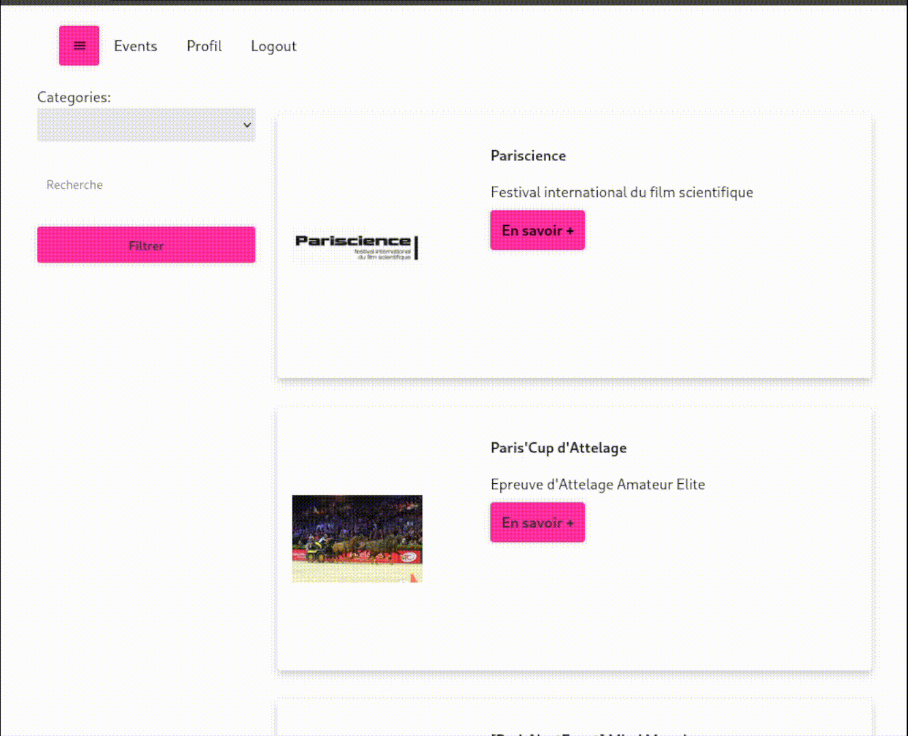

<h2 align="center">Développeur Full-Stack — Épitech, Paris</h2>

- 🔭 Je travaille actuellement sur **des projets web à Épitech.**

- 🌱 J'apprends principalement **Javascript, PHP, React/NodeJS**.

- 📙 J'ai une préférence pour le backend, notemment **NodeJS/Express MySQL/MongoDB**

- 📫 Comment me contacter : <a href="mailto:gildas.le-drogoff@epitech.eu">**gildas.le-drogoff@epitech.eu**</a>

  

<section class="section projects-section" >
  

  <h2>Quelques projets</h2>
  
   

       

        
         

       

        
         
         

       

        
         

       </section>
   

<h2 align="left">Langages et outils :</h2>

  
  
  
  
  
  
  
  
  
  
  
  
  

